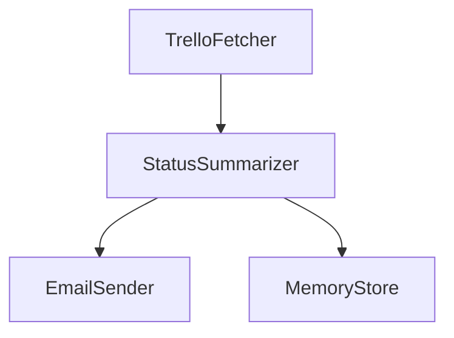

# Mira Project Agent

An autonomous AI agent built with LangGraph to generate weekly project status reports from Trello and deliver them via email. Designed for intelligent orchestration, memory logging, and future extensibility.

---

## Features

- Fetches Trello tasks from a board or list
- Summarizes tasks into a weekly status report using OpenAI
- Sends the report via email to stakeholders
- Logs each summary for historical tracking
- Modular LangGraph architecture for easy expansion

---

## Architecture


## Setup
1. Clone the repo 
```git clone https://github.com/johnprakashgithub/AI --branch mira-project-agent```
2. Create .env file in root:
```
TRELLO_API_KEY=your_trello_api_key
TRELLO_TOKEN=your_trello_token
TRELLO_BOARD_ID=your_board_id
OPENAI_API_KEY=your_openai_api_key
SMTP_HOST=smtp.gmail.com
SMTP_PORT=587
SMTP_USER=your@email.com
SMTP_PASSWORD=your_app_password
EMAIL_FROM=your@email.com
EMAIL_TO=stakeholders@email.com
```
3. Install dependencies 
```pip install -r requirements.txt```
4. Run the agent 
```python graph/mira_graph.py```
